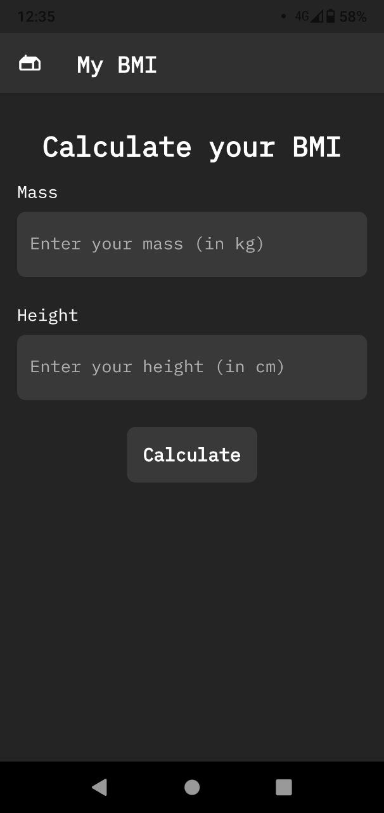
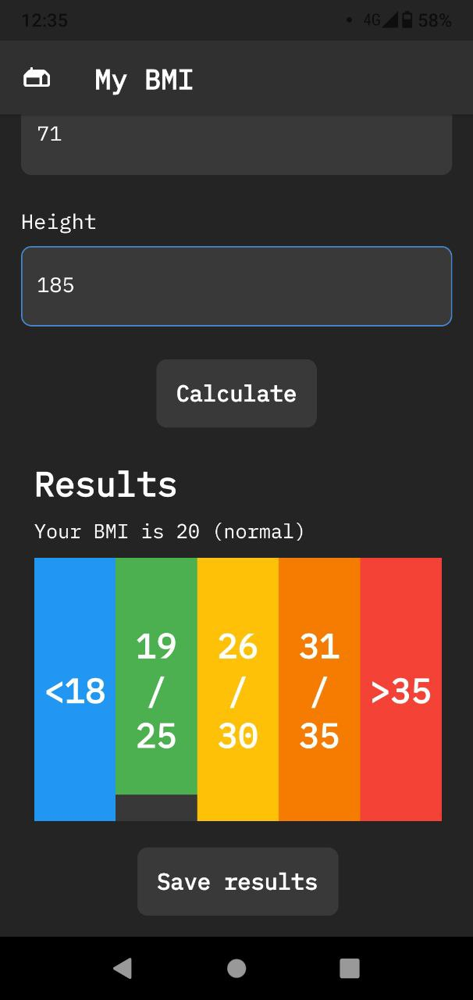
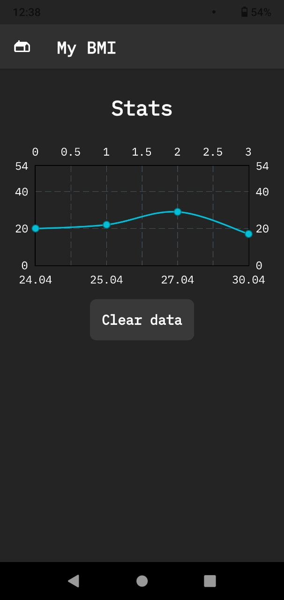

# My BMI

**My BMI** is a test Flutter project to calculate BMI (body mass index)

## Features

* BMI calculating with data validation
* Saving/loading data to/from disk
* Unique UI/UX design
* Charts data presentation
* Custom UI widgets

## Screenshots

## License

This software is licensed under permissive Unlicense license and is in a public domain